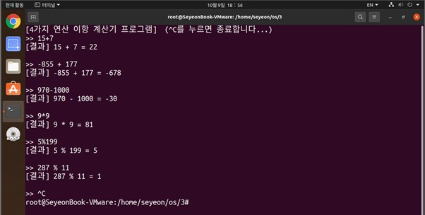
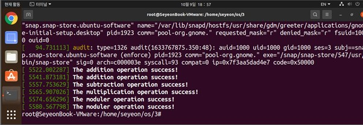

# 시스템 콜 함수 구현
## 구현 내용
* 덧셈(+), 뺄셈(-), 곱셈(*), 나머지(%) 등 4가지 연산 기능을 제공하는 시스템 콜을 추가
* 추가한 시스템 콜을 호출하는 테스트 프로그램을 구현   

## 구현 설명
1. 시스템 콜 테이블 등록(syscall_64.tbl)     
파일 경로 : ```/usr/src/linux/linux-5.11.22/arch/x86/entry/syscalls/```   

2. 시스템 콜 헤더 파일에 등록(syscalls.h)   
파일 경로 : ```/usr/src/linux/linux-5.11.22/include/linux/```   

3. 시스템 콜 함수 구현(sys_basic_add.c / sys_basic_sub.c / sys_basic_mul.c / sys_basic_mod.c)   
파일 경로 : ```/usr/src/linux/linux-5.11.22/kernel/```

4. Makefile에 등록(Makefile)   
파일 경로 : ```/usr/src/linux/linux-5.11.22/kernel/```

5. 시스템 콜을 호출하는 테스트 프로그램 구현(syscall_operation.c)

6. ```dmesg``` 명령어 통해 커널 로그를 출력하여 추가된 시스템 콜 함수의 실행을 확인

## 실행 결과   
- 수식을 입력받으면, 시스템 콜을 통해 수행한 연산 결과를 화면에 출력 
</img><br/>   

- ```dmesg``` 명령어를 통해 연산을 수행했음을 확인 
</img><br/>   