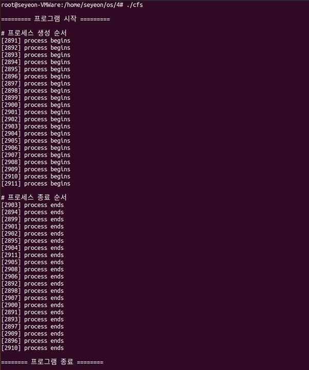
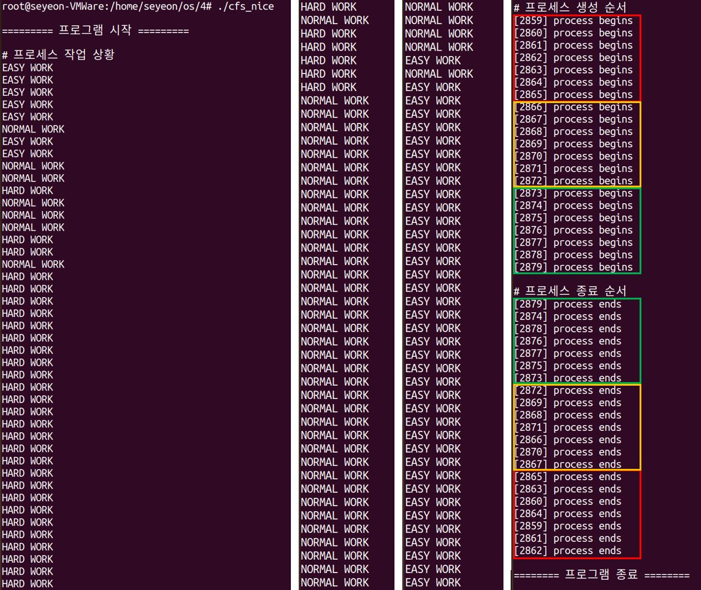
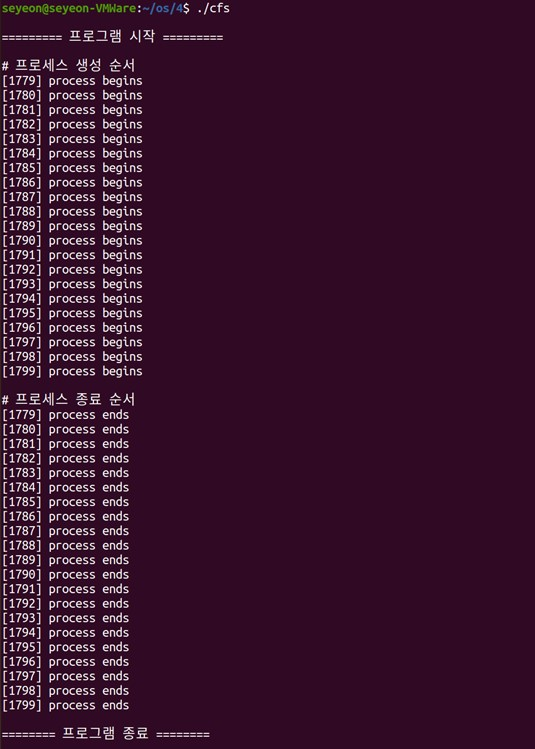

# 리눅스 커널의 스케줄링 정책 비교 프로그램 구현
## 구현 내용
* 리눅스 커널 기본 스케줄링 정책인 CFS
* 조정된 NICE 값을 적용한 CFS
* 커널 수정을 통한 Real-Time FIFO Scheduler
* 커널 수정을 통해 각 프로세스의 CPU 점유 시간의 누적값을 측정       
## 파일 설명     
* ### fifo/core.c   
    Real-time FIFO로 동작하기 위해 수정한 core.c 커널 코드   
    파일 경로 : ```/usr/src/linux/linux-5.11.22/kernel/sched/```
* ### cfs/core.c   
    cpu burst time을 출력하기 위해 수정한 core.c 커널 코드  
    파일 경로 : ```/usr/src/linux/linux-5.11.22/kernel/sched/```
* ### stats.h   
    CPU가 점유한 시간인 delta 값을 새로 만든 변수에 저장하는 코드 추가   
    파일 경로 : ```/usr/src/linux/linux-5.11.22/kernel/sched/```
* ### sched.h
    task_struct 구조체에 cpu burst time 값을 저장할 변수를 추가   
    파일 경로 : ```/usr/src/linux/linux-5.11.22/include/linux/```
* ### cfs.c
    Nice 값을 조정하지 않는 기본 CFS를 테스트 하기 위해 작업량이 동일함   
* ### cfs_nice.c
    Nice 값 조정으로 우선순위에 따라 그룹의 작업 순서가 다름을 보이도록 함   

## 실행 결과
* 프로세스가 기본 CFS 정책에 따라 점유
    </img><br/>

* 생성한 프로세스의 작업을 수행하다가, Nice 값을 낮게 준 프로세스가 먼저 점유
    </img><br/>

* 프로세스가 Real-time FIFO 스케줄러에 따라 순서대로 점유
    </img><br/>
