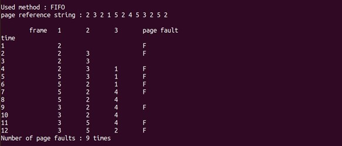

# 가상 메모리를 관리하기 위한 Page Replacement 기법 시뮬레이터 구현
## 구현 내용
* Optimal Algorithm
* FIFO Algorithm
* LRU Algorithm
* Second-Chance Algorithm   

## 실행 결과
* Optimal Algorithm   
    </img> 

* FIFO Algorithm   
    </img> 

* LRU Algorithm   
    </img> 

* Second-Chance Algorithm    
    </img> 
