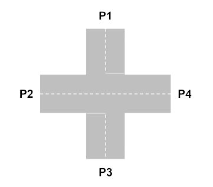
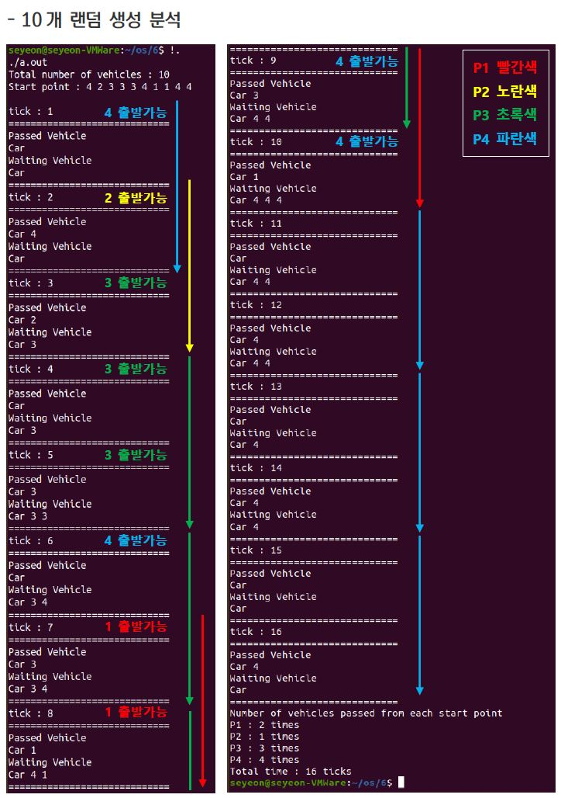
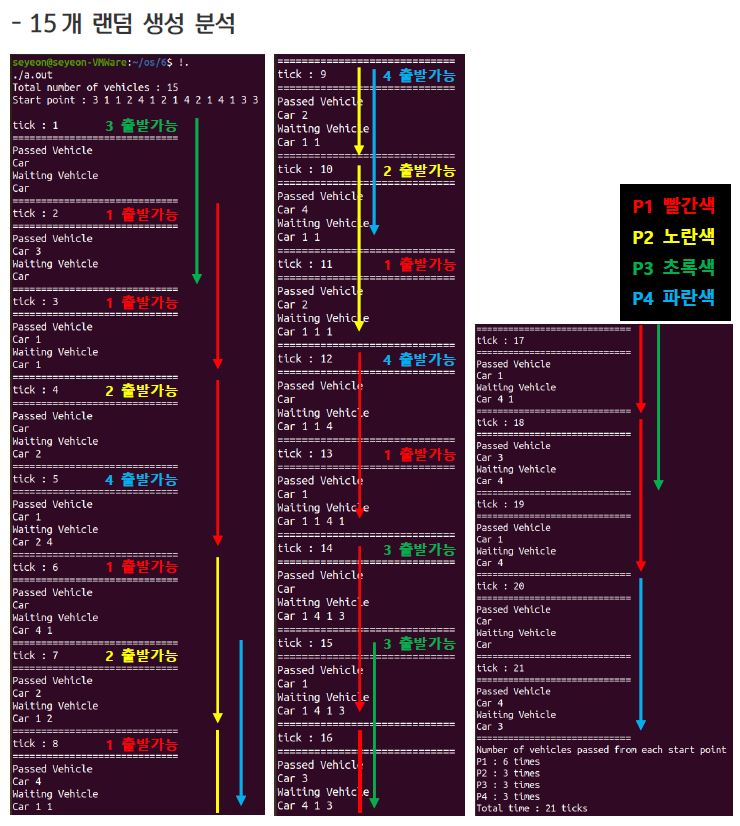

# Pthread를 이용하여 교차로에서의 차량 진입 문제 해결 프로그램 구현
</img>       

## 구현 내용
* Pthread 사용   
* Synchronization Tool(Mutex Lock, Condition Variable) 사용   
### 입력
* 프로그램 실행 초기화면에서 사용자는 10 ~ 15 사이의 정수를 입력
* 프로그램은 사용자가 입력한 정수만큼 1에서 4 사이의 숫자를 무작위로 생성하여 출발지점 리스트를 생성
### 조건
* 각 출발 지점에서의 차량 출발은 각각 다른 Thread가 제어
* 1초마다 출발 지점 리스트의 순서대로 차량이 출발 가능함
* 각각의 출발점에서는 마주 보는 방향으로만 진행할 수 있음 (P1 <-> P3, P2 <-> P4)
* 차량이 출발점을 출발하여 교차로를 빠져나가 도착하는데 2초가 소요됨
* 차로는 한 방향으로 한 번에 한 대의 차량만 지나갈 수 있음
* 인접한 위치의 차량이 차로를 점유하고 있을 때는 진행이 가능할 때까지 대기
* 마주 보는 위치의 차량이 차로를 점유하고 있을 때는 그대로 진행 가능함
* 대기하는 차량은 한 번에 한 대만 진행이 가능
* 대기하는 차량이 두 대 이상 존재할 경우 랜덤하게 하나의 차량을 선택
### 출력
* 프로그램 시작 시 전체 진행되는 차량의 수, 진행되는 출발 지점 리스트를 출력
* 매 초마다 교차로를 빠져나가는 차량의 정보와 대기 중인 차량의 정보를 출력
* 마지막에는 각 출발점마다 총 진행된 차량 수, 모든 차량이
통과하는데 걸린 총 걸린 시간을 출력

## 실행 결과 분석
</img>       
</img> 
